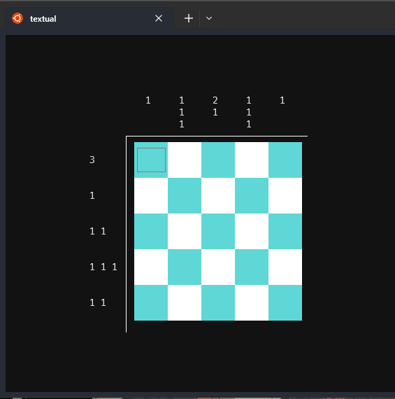
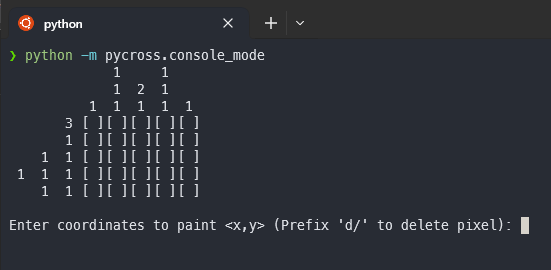

# Pycross

Nonogram puzzles in python

## Run game on Terminal Mode

```bash
textual run pycross/play.py

# or

python -m pycross
```

Move with across the board using the cursor keys and press `z` to paint/clear a tile. Or just use the mouse to hover on a tile and click to paint/clear it.

Exit game: `ctrl` + `q`



## Run game on Console Mode

```bash
python -m pycross.console_mode
```


